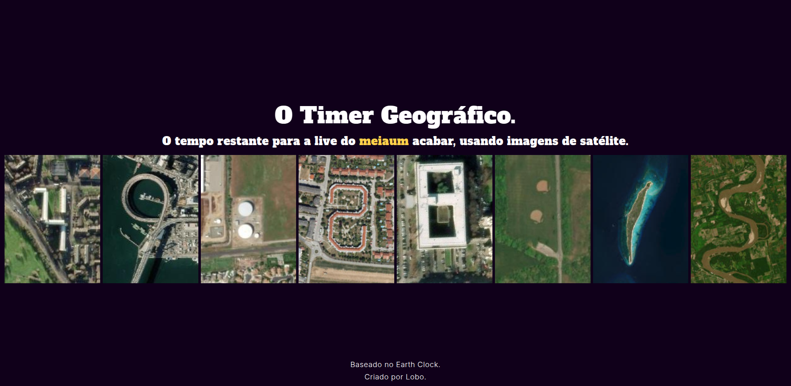

  <h1>O Timer Geográfico</h1>

  

 

O Timer Geográfico é uma site que mostra o tempo restante para a live do [omeiaum](https://twitch.com/omeiaum) acabar, mas usando imagens de satelite.

O projeto foi baseado no [Earth Clock](https://earthclock.cwandt.com/).
